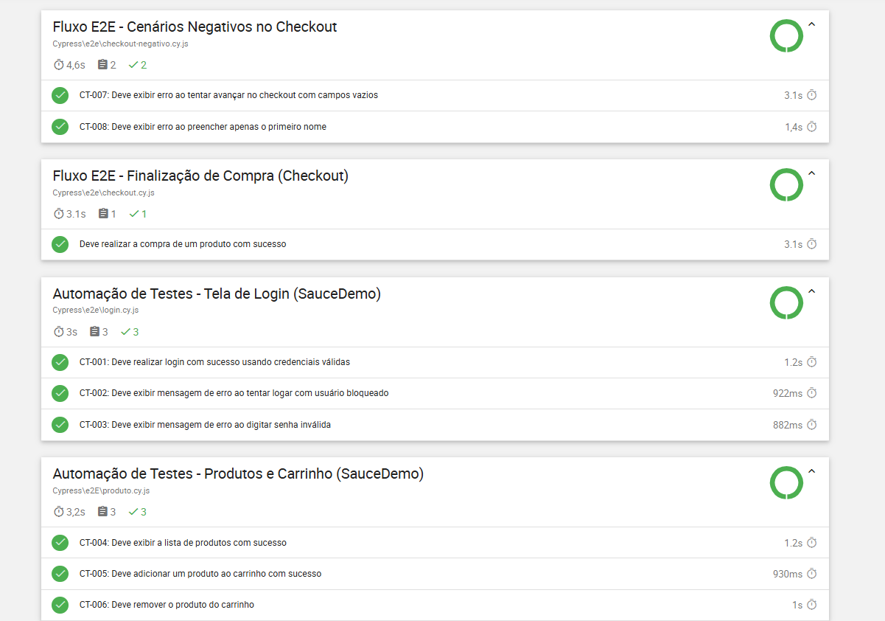
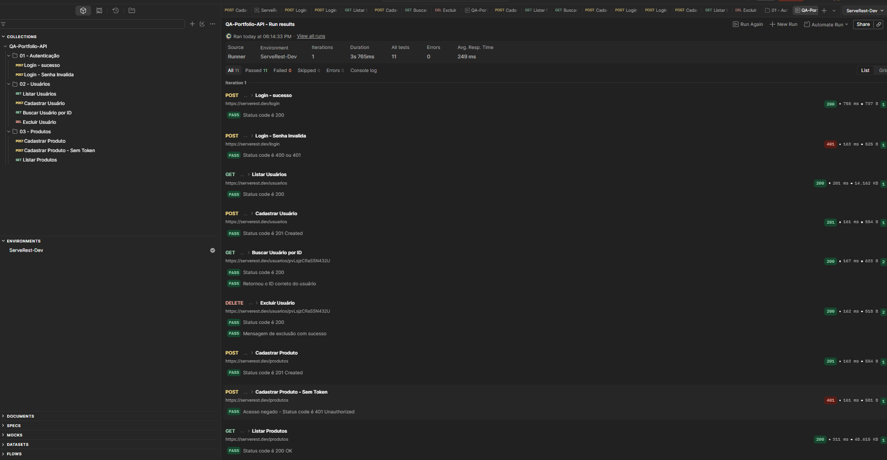
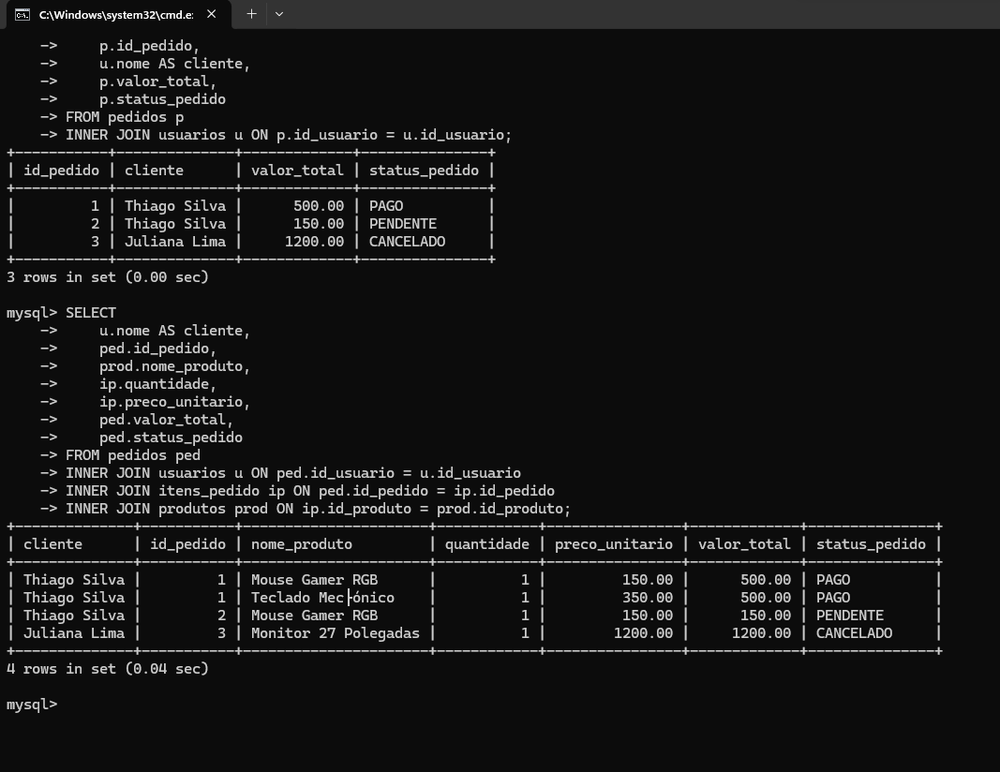

# 🧪 QA Portfolio — Thiago Cupla


Portfólio profissional de Qualidade de Software com foco em:

- [x] Testes Manuais
- [x] Testes de API REST
- [x] Validação com SQL
- [x] Automação E2E com Cypress

---

## 👤 Sobre mim

Sou um profissional em transição para a área de Qualidade de Software, com foco em garantir a qualidade de aplicações através de testes bem estruturados, validação de APIs e automação.

🎯 **Objetivo:** Primeira oportunidade como QA Junior  
📍 **Localização:** Brasil  
🔗 **LinkedIn:** [thiago-tiburcio-295217117](https://www.linkedin.com/in/thiago-tiburcio-295217117/)

---

## 🚀 Projeto em Destaque: Automação E2E com Cypress (SauceDemo)

Projeto de automação End-to-End cobrindo os fluxos críticos do e-commerce [SauceDemo](https://www.saucedemo.com/), integrado com relatórios consolidados em HTML e pipeline de CI/CD automatizada.

### 🛠️ Tecnologias Utilizadas

- **Cypress** — Framework de automação E2E
- **JavaScript** — Linguagem de programação dos scripts
- **Mochawesome Reporter** — Relatórios consolidados com gráficos
- **GitHub Actions** — Esteira de integração contínua (CI/CD)

### 📋 Cobertura de Testes Automatizados

- **Autenticação (Login):**
  - `CT-001`: Login com credenciais válidas.
  - `CT-002`: Mensagem de erro para usuário bloqueado.
  - `CT-003`: Mensagem de erro para senha inválida.
- **Produtos e Carrinho:**
  - `CT-004`: Exibição da lista de produtos com sucesso.
  - `CT-005`: Adição de produto ao carrinho.
  - `CT-006`: Remoção de produto do carrinho.
- **Fluxo de Checkout (Positivo e Negativo):**
  - `Fluxo Principal`: Finalização de compra completa com sucesso.
  - `CT-007`: Validação de erro ao tentar avançar com campos vazios.
  - `CT-008`: Validação da obrigatoriedade do campo de sobrenome.



---

### 💻 Como Executar o Projeto de Automação

1. Clone o repositório:

```bash
git clone https://github.com/thiagocupla/qa-portfolio.git
cd qa-portfolio
```

## ⚙️ Testes de API REST (Postman)

Validação de contratos e regras de negócio no backend, garantindo a integridade dos dados antes de chegarem à interface.

- **Ferramentas:** Postman, API ServeRest.
- **Destaques:**
  - Criação de Collections estruturadas e separação por rotas.
  - Uso de variáveis de ambiente para dinamizar os testes.
  - Validações de requisições GET, POST, PUT e DELETE.
    

---

## 🗄️ Validação de Banco de Dados (SQL)

Modelagem de dados e consultas avançadas para auditar regras de negócio direto na base de dados de um e-commerce.

- **Ferramentas:** MySQL, Linha de Comando (CLI).
- **Destaques:**
  - Criação de banco de dados e injeção de massa de testes (Scripts DML/DDL).
  - Consultas para testes de cenários negativos (ex: usuários bloqueados e produtos sem estoque).
  - Rastreabilidade completa cruzando múltiplas tabelas (`INNER JOIN`) para auditar pedidos e itens comprados.
    
